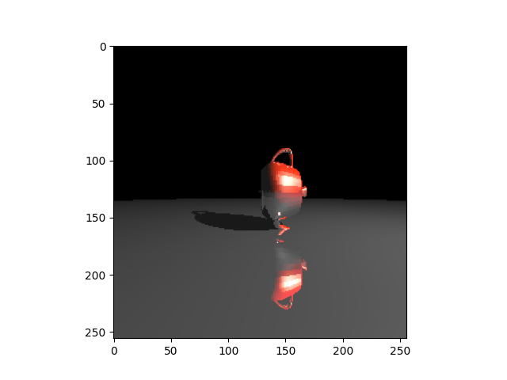
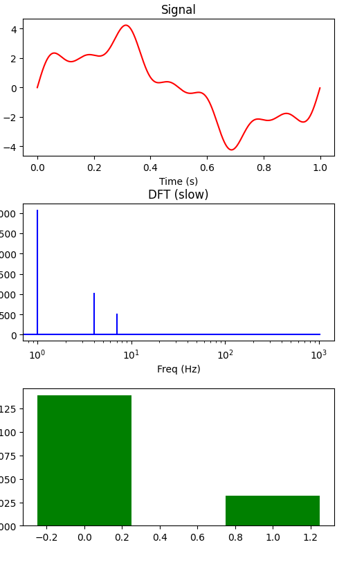
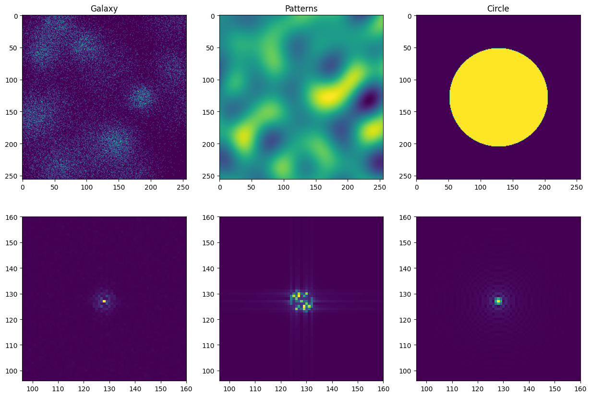
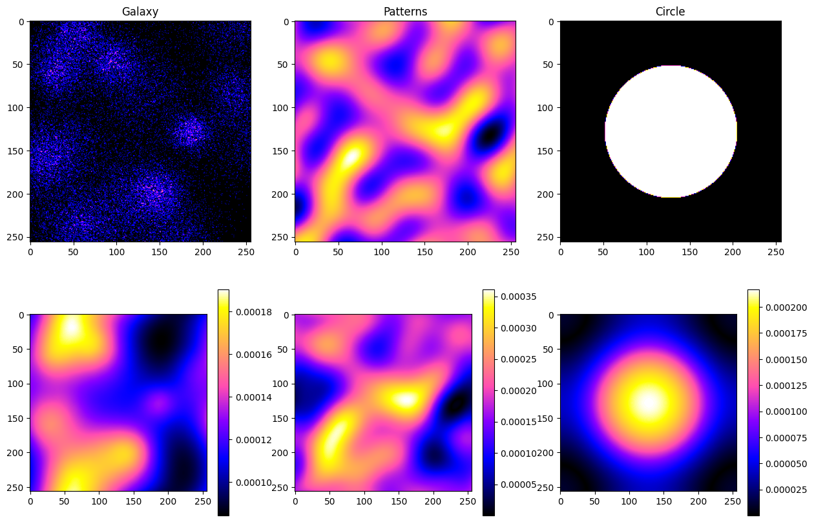

# Code produced during the couse "Advanced Simulations in Natural Sciences" at the University of Zürich

A pytorch based raytracer with optimization for sparse scenes:

DFT and FFT implementation:  

2D FFT implementations:  

Solving for potential using 2D FFT and Poisson equation:

